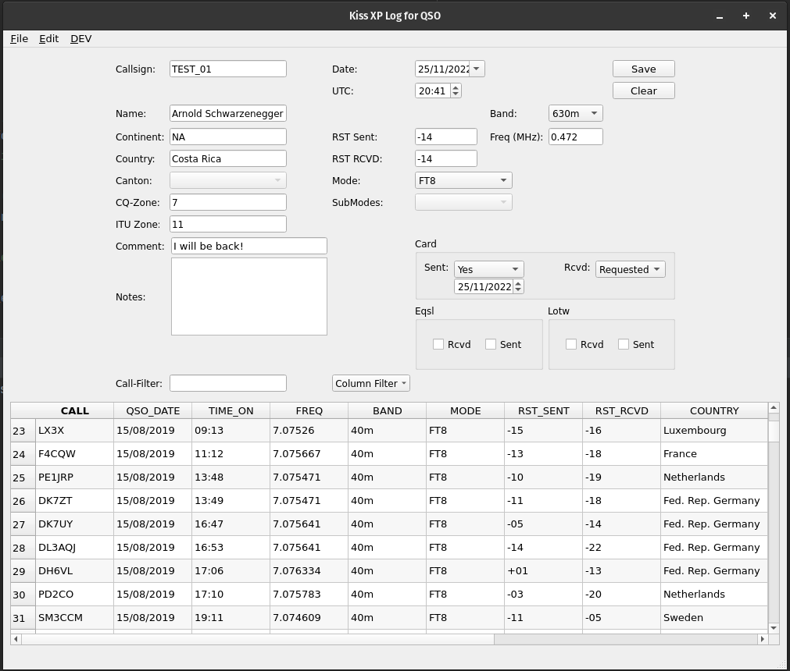
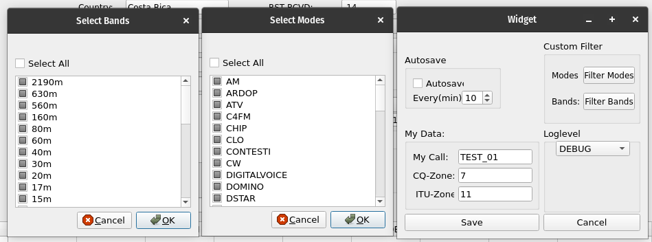

# KissXPLog

=  **K**eep **I**t **S**imple, **S**tupid + Cross(**X**)-**P**latform + Log

----------




Dieses Programm kann zum Verwalten von Verbindungen im Amateurfunk benutzt werden.

# Motivation

* Open Source
* Fokus auf die Verwaltung von QSOs, kein All in One Programm.
* Modernes GUI sowie zeitgemässe Programmiersprache.
* Aktive Entwicklung und einfache Dateiformate um Inkompatibilitäten zu vermeiden.
* Cross Platform
* Lernprojekt für Python ;)

# Bedienung:

* Tabelle Laden oder ADIF importieren übers File Menu.
* Editieren von vorhandenen Einträgen oder hinzufügen von neuen Einträgen.
* Änderungen jeweils durch Klicken auf [Save] bestätigen.
* Wenn die Sitzung zu Ende ist, die Tabelle speichern über File -> Save Table.

**[Save]** \
Speichert die geänderten Einträge in die Tabelle.

**[Clear]** \
Die Eingabemaske wird zurückgesetzt.

**Filter**
Es wird nach Rufzeichen gefiltert.

**Tabelle**
Diese lässt sich wie gewohnt sortieren mit einem Klick auf die Kopfleiste. Spalten lassen sich über Column Filter
ausblenden.

## Konfiguration

Über 'File --> Show Config Dialog'



### Autosave

* Ermöglicht das automatische Speichern in regelmässigen Abständen (Minuten).
* Beim Eintrag (0 Minuten) wird automatisch jede Änderung gespeichert.

### Custom Filter

* Ermöglichen es eine Auswahl zu Treffen, welche Werte im GUI zur Verfügung stehen.
* Die Einträge entsprechen denen auf adif.org gelisteten. (stand 26.1.2022)

### My Data

* Diese Einstellungen werden momentan noch nicht ausgewertet. > TODO

### Loglevel

* Einstellen des Log Levels für Fehler.

## Einlesen

### File -> Load Table

* Über den Filebrowser lässt sich eine JSON datei einlesen.
* Doppelte Einträge werden Ignoriert.
* Es findet ein Update statt, welches folgende Felder auswertet:\
  `"Call", "QSO Date","Mode","Band","Time On".`\
  Bei übereinstimmung wird das Qso mit den meisten Feldern genommen

### File -> Import Adif

* Über den Filebrowser lässt sich eine Adif datei einlesen.
* Doppelte Einträge werden Ignoriert.
* Es findet ein Update statt, welches folgende Felder auswertet:\
  `"Call", "QSO Date","Mode","Band","Time On".`\
  Bei übereinstimmung wird das Qso mit den meisten Feldern genommen.

## Speichern

### File -> Save Table

* Die aktuelle Tabelle wird im JSON Format gespeichert.
* Ort sowie Dateiname können mittels Filebrowser bestimmt werden.
* Die Datei wird erstellt wenn nicht vorhanden.
* Falls die Datei bereits existiert wird sie überschrieben.

### File -> Export Adif

* Die aktuelle Tabelle wird im Adif Format exportiert.
* Ort sowie Dateiname können mittels Filebrowser bestimmt werden.
* Die Datei wird erstellt wenn nicht vorhanden.
* Die Datei wird überschrieben, falls sie existiert.

## Editieren

Durch Klicken eines Eintrages in der Tabelle wird dieser in die Eingabemaske geladen. Hier können Änderungen vorgenommen
werden.

### Edit -> Edit Table

Durch `Edit Table` können Einträge direkt in der Tabelle editiert werden.\
Die geänderten Felder werden beim Verlassen des Feldes oder durch [Enter] im GUI gespeichert.\
Durch Drücken von [ESC] werden die Änderungen verworfen.\
Durch erneutes Drücken von [Edit Table] wird diese Funktionalität wieder deaktiviert.

### Edit -> ResetForm

Die Eingabemaske wird zurückgesetzt. Die Sortierung der Tabelle wird ebenfalls zurückgesetzt

### Update Plist

Läd die aktuellste Version der Cty.dat von: 'https://www.country-files.com/' herunter. Diese wird für das automatische
Vervollständigen von Qsos benötigt.

# Building

## PyInstaller

Mittels [PyInstaller](https://github.com/pyinstaller/pyinstaller) kann aus dem Python-code betriebssystemunabhängig eine
ausführbare Datei erstellt werden (Linux/Windows).

Um das Projekt auf einem Debian-basierten System selbst zu kompilieren, müssen noch einige Packages installiert werden:

```commandline
sudo apt install python3-venv binutils python3-dev qtbase5-dev qtchooser qt5-qmake qtbase5-dev-tools
```

ab hier ist es relativ betriebssystemunabhängig:

```commandline
git clone https://github.com/Punki/KissXPLog
cd KissXPLog
git pull
python3 -m venv venv
. venv/bin/activate
bzw. 'venv\Scripts\activate.bat' auf Windows
pip install -r requirements.txt
pip install pyinstaller
```

Jetzt kann mittels des installierten PyInstaller die ausführbare Datei erstellt werden:

```commandline
pyinstaller build.spec
```

Dieser Befehl erstellt mithilfe der [build.spec](build.spec) die Datei 'dist/KissXPLog(.exe)', mit das Programm
gestartet werden kann.

## Virtual Environment (venv)

Das venv kann entweder direkt via IDE erstellt werden, oder via Python-Konsole mit
`python -m venv venv`.

Das neue venv wird mit `. venv/bin/activate` (UNIX) bzw. `venv\Scripts\activate.bat` (Windows) aktviert.

Im neuen venv werden die requirements jetzt mit `pip install -r requirements.txt` installiert.

## GUI-Änderungen:

GUI-Änderungen werden mit QT Designer im File [logger_gui.ui](KissXPLog/logger_gui.ui) gemacht.\
Diese Änderungen werden mit folgendem Befehl kompiliert:\
`pyuic5 -x logger_gui.ui -o logger_gui.py`

## Files:

MainWindow: [kiss_xp_log.py](KissXPLog/kiss_xp_log.py) \
GUI: [logger_gui.py](KissXPLog/logger_gui.py) -> Nicht manuell ändern!\
Tabellen Modell: [table_model.py](KissXPLog/table_model.py) \
QSO List Mutations: [qso_operations.py](KissXPLog/qso_operations.py)\
File Operations: [file_operations.py](KissXPLog/file_operations.py)\
ADIF Data Operations: [adif.py](KissXPLog/adif.py)\
ADIF Feld Konstanten: [const_adif_fields.py](KissXPLog/const_adif_fields.py)\
Benutzer Konfiguration: [config.py](KissXPLog/config.py)\
Logging Setup: [messages.py](KissXPLog/messages.py)\
QRZ Lookup: [qrz_lookup.py](KissXPLog/qrz_lookup.py)

# Datenstruktur:

## Adif Format

Siehe hierzu unter: https://www.adif.org/

TLDR: Das Format speichert Informationen in Triples, welche jeweils aus einem Namen, Länge und Wert bestehen.\
Z.B: `<call:5>AAAAA`

* Name des Feldes: "CALL"
* Länge des Feldes: 5
* Wert des Feldes: "AAAAA"

 
## QSO

Jedes QSO wird in einem Dictionary gespeichert, welche sich jeweils aus Key:Value Tupeln zusammensetzt:\
`{"CALL": "AAAAA", "QSO_DATE": "20001111", ...}`\
Mehrere dieser Dictionary's werden in einer Liste zusammengefasst:

  ``` 
[
{"CALL": "AAAAAA", "QSO_DATE": "20001111"},
 {"CALL": "BBBBBB", "QSO_DATE": "20002222"}
]
  ```

### Minimum für ein gültiges QSO

* Callsign
* Date
* UTC Time
* Frequency
* Mode
* RST Sent/Rst RCVD


----------------------

# Features

- Es werden automatisch Kontinent, Land, sowie CQ und ITU Zone beim Verlassen des Rufzeichenfelds erfasst.
- Für gewisse Modis werden automatisch Default Werte für RST erfasst.
- Bei der Eingabe der Frequen wird das Band erfasst und Vice Versa.
- > Es werden keine Felder überschrieben wenn bereits Daten vorhanden sind.

## Geplante Features

- Anzeige ob Tabelle in Edit mode ist oder nicht.
    - Statusleiste
- Rückmeldung, wenn Speichern erfolgreich.
    - Statusleiste
- Filter zurücksetzen -> Reset form
- QSO-Map Integration (https://www.qsomap.org/)
- Anbindung Datenbank
    - Anzeigen, wie viele Records betroffen sind bei Änderungen

# Bugs

* [File-Chooser Tests](tests/unit/test_file_chooser_dialog.py) funktioniert nicht auf Linux, da 'keyboard' package unter
  Linux root-Recht will
